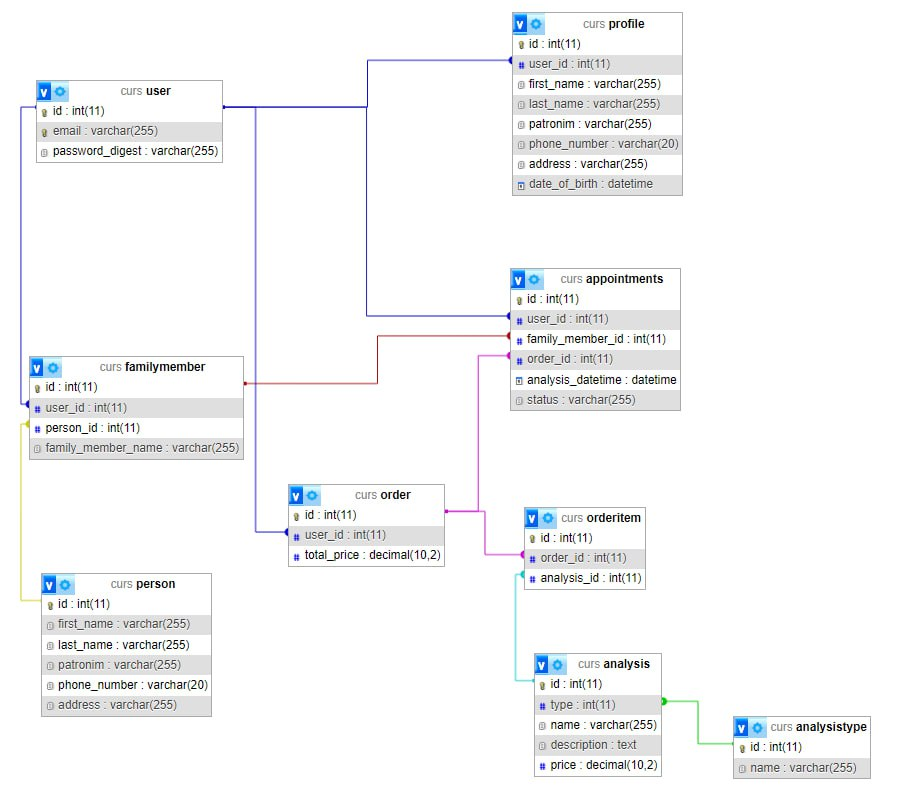

# CSLab
### Запис на аналізи
## ER Діяграма

## API документація
| Prefix Verb                  | URI Pattern                             | Controller#Action       |
|------------------------------|-----------------------------------------|-------------------------|
| order_order_items POST       | /orders/:order_id/order_items(.:format) | order_items#create      |
| orders GET                   | /orders(.:format)                       | orders#index            |
| POST                         | /orders(.:format)                       | orders#create           | 
| order GET                    | /orders/:id(.:format)                   | orders#show             |
| analyses GET                 | /analyses(.:format)                     | analyses#index          |
| add_self_family_members POST | /family_members/add_self(.:format)      | family_members#add_self |
| family_members GET           | /family_members(.:format)               | family_members#index    |
| new_family_member GET        | /family_members/new(.:format)           | family_members#new      |
| profiles GET                 | /profiles(.:format)                     | profiles#index          |
| edit_profile GET             | /profiles/:id/edit(.:format)            | profiles#edit           |
| new_user_registration GET    | /users/sign_up(.:format)                | registrations#new       |
| new_user_session GET         | /users/sign_in(.:format)                | devise/sessions#new     |
| destroy_user_session DELETE  | /users/sign_out(.:format)               | devise/sessions#destroy |
## Інструкція з встановлення
1. Встановити версію Ruby 3.2.2;
2. Встановити Postgre та PgAdmin;
3. Задати юзернейм та пароль в PgAdmin; 
4. Завантажити проєкт з репозиторію GitHub (https://github.com/VadimPomazan/CourseWokrMPP);
5. Перейти в папку, куди був завантажений репозиторій, та в файлі config/database.yml задати юзернейм та пароль;
6. В командній строці перейти в папку проєкту, та прописати такі команди:
    + bundle install
    + rails db:create
    + rails db:migrate
    + rails server
